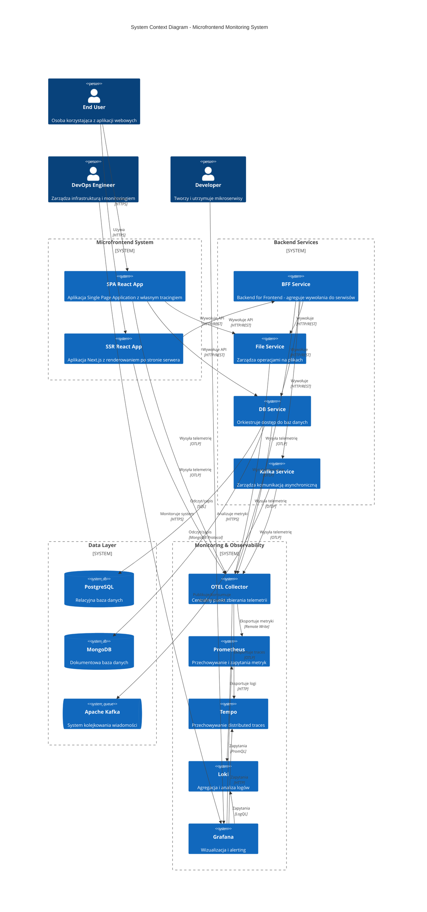

# C4 Model - Level 1: System Context Diagram

## Przegląd

Diagram kontekstu systemowego przedstawia system monitorowania mikrofrontendów na najwyższym poziomie abstrakcji. Pokazuje główne komponenty systemowe i ich interakcje z użytkownikami oraz systemami zewnętrznymi.

## Diagram

## Główne Komponenty

### Użytkownicy

- **End User** - Końcowy użytkownik korzystający z aplikacji webowych (SPA i SSR)
- **DevOps Engineer** - Odpowiedzialny za infrastrukturę, monitoring i alerty
- **Developer** - Rozwija i utrzymuje mikroserwisy, analizuje metryki wydajności

### Systemy Frontendowe

- **SPA React App** - Aplikacja Single Page Application z własną instrumentacją OpenTelemetry
- **SSR React App** - Aplikacja Next.js z renderowaniem po stronie serwera, korzysta z BFF

### Backend Services

- **BFF Service** - Backend for Frontend, agreguje wywołania dla SSR App
- **File Service** - Zarządza operacjami na plikach
- **DB Service** - Orkiestruje dostęp do wielu baz danych (Postgres + Mongo)
- **Kafka Service** - Zarządza komunikacją asynchroniczną przez Kafka

### Data Layer

- **PostgreSQL** - Relacyjna baza danych
- **MongoDB** - Dokumentowa baza danych
- **Apache Kafka** - System kolejkowania wiadomości dla komunikacji asynchronicznej

### Monitoring & Observability

- **OTEL Collector** - Centralny punkt zbierania telemetrii (metryki, traces, logi)
- **Prometheus** - Time-series database dla metryk
- **Tempo** - Backend dla distributed tracing
- **Loki** - System agregacji logów
- **Grafana** - Platforma wizualizacji i alertingu

## Kluczowe Przepływy

1. **User Journey Flow**:
   - Użytkownik → SPA/SSR App → Backend Services → Data Layer

2. **Telemetry Flow**:
   - Wszystkie komponenty → OTEL Collector → Storage Backends → Grafana

3. **Monitoring Flow**:
   - DevOps/Developer → Grafana → Backends (Prometheus/Tempo/Loki)

## Główne Cele Systemu

1. **Dostępność** - Monitorowanie dostępności mikrofrontendów i serwisów backendowych
2. **Wydajność** - Śledzenie czasu odpowiedzi, przepustowości i wykorzystania zasobów
3. **Observability** - Pełna widoczność przez metryki, traces i logi
4. **Alerting** - Proaktywne powiadamianie o problemach i degradacji wydajności
5. **Correlation** - Korelacja metryk frontendowych z wydajnością backendu

## Zewnętrzne Zależności

System nie posiada bezpośrednich zależności od zewnętrznych systemów trzecich. Wszystkie komponenty działają w izolowanym środowisku Docker Compose.
