# C4 Model - Level 2: Container Diagram

## Przegląd

Diagram kontenerów przedstawia high-level technologiczny widok systemu. Pokazuje główne kontenery (aplikacje, bazy danych, serwisy) i sposób w jaki komunikują się między sobą.

## Diagram

```mermaid
C4Container
    title Container Diagram - Microfrontend Monitoring System

    Person(user, "End User", "Użytkownik aplikacji webowych")
    Person(devops, "DevOps Engineer", "Zarządza monitoringiem")

    System_Boundary(frontend_boundary, "Frontend Applications") {
        Container(spa_react, "SPA React App", "React 18, Vite, TypeScript", "Single Page Application z TanStack Router i własną instrumentacją OTEL")
        Container(ssr_react, "SSR React App", "Next.js 15, React 19, TypeScript", "Server-Side Rendered application z React Query")
        
        Container(spa_tracer, "Frontend Tracer", "OpenTelemetry Web", "Tracer dla SPA - zbiera metryki wydajnościowe i tworzy spany")
        Container(ssr_tracer, "Instrumentation", "OpenTelemetry Node", "Server-side instrumentation dla Next.js")
    }

    System_Boundary(backend_boundary, "Backend Services") {
        Container(bff_service, "BFF Service", "Node.js, Express, TypeScript", "Backend for Frontend - agreguje wywołania dla SSR App (port 8087)")
        Container(file_service, "File Service", "Node.js, Express, TypeScript", "Zarządza operacjami na plikach (port 8080)")
        Container(db_service, "DB Service", "Node.js, Express, TypeScript", "Orkiestruje dostęp do baz danych (port 8083)")
        Container(kafka_service, "Kafka Service", "Node.js, Express, KafkaJS", "Producent wiadomości Kafka (port 8084)")
        
        Container(postgres_service, "Postgres Service", "Node.js, Express, pg", "Anti-corruption layer dla PostgreSQL (port 8082)")
        Container(mongo_service, "Mongo Service", "Node.js, Express, mongodb", "Anti-corruption layer dla MongoDB (port 8081)")
        
        Container(kafka_receiver_a, "Kafka Receiver A", "Node.js, KafkaJS", "Konsument topic: random-number-topic-a (port 8085)")
        Container(kafka_receiver_b, "Kafka Receiver B", "Node.js, KafkaJS", "Konsument topic: random-number-topic-b (port 8086)")
    }

    System_Boundary(data_boundary, "Data Layer") {
        ContainerDb(postgres_db, "PostgreSQL", "PostgreSQL 17", "Relacyjna baza danych (port 5432)")
        ContainerDb(mongo_db, "MongoDB", "MongoDB 8", "Dokumentowa baza danych (port 27017)")
        ContainerQueue(kafka_broker, "Kafka Broker", "Apache Kafka 3.8", "Message broker (port 9092)")
        Container(zookeeper, "Zookeeper", "Zookeeper 3.9", "Koordinacja dla Kafka (port 2181)")
    }

    System_Boundary(observability_boundary, "Observability Stack") {
        Container(otel_collector, "OTEL Collector", "OpenTelemetry Collector", "Centralny punkt zbierania telemetrii (gRPC: 4317, HTTP: 4318)")
        
        ContainerDb(prometheus, "Prometheus", "Prometheus 3.0", "Time-series database dla metryk (port 9090)")
        ContainerDb(tempo, "Tempo", "Grafana Tempo 2.6", "Distributed tracing backend (port 3200)")
        ContainerDb(loki, "Loki", "Grafana Loki 3.2", "Log aggregation system (port 3100)")
        
        Container(grafana, "Grafana", "Grafana 11.3", "Platforma wizualizacji i alertingu (port 3000)")
        Container(alloy, "Grafana Alloy", "Grafana Alloy", "Telemetry collector (alternatywny)")
    }

    Rel(user, spa_react, "Używa", "HTTPS")
    Rel(user, ssr_react, "Używa", "HTTPS")

    BiRel(spa_react, spa_tracer, "Instrumentacja")
    BiRel(ssr_react, ssr_tracer, "Instrumentacja")

    Rel(spa_react, file_service, "GET /file", "HTTP/REST")
    Rel(spa_react, db_service, "GET /db", "HTTP/REST")

    Rel(ssr_react, bff_service, "GET /file, /db, /kafka", "HTTP/REST")
    Rel(bff_service, file_service, "GET /file", "HTTP/REST")
    Rel(bff_service, db_service, "GET /db", "HTTP/REST")
    Rel(bff_service, kafka_service, "GET /kafka", "HTTP/REST")

    Rel(db_service, postgres_service, "GET /postgres", "HTTP/REST")
    Rel(db_service, mongo_service, "GET /mongo", "HTTP/REST")

    Rel(postgres_service, postgres_db, "Query", "PostgreSQL Protocol")
    Rel(mongo_service, mongo_db, "Query", "MongoDB Protocol")

    Rel(kafka_service, kafka_broker, "Publish", "Kafka Protocol")
    Rel(kafka_receiver_a, kafka_broker, "Subscribe", "Kafka Protocol")
    Rel(kafka_receiver_b, kafka_broker, "Subscribe", "Kafka Protocol")
    Rel(kafka_broker, zookeeper, "Coordination", "ZK Protocol")

    Rel(spa_tracer, otel_collector, "Telemetry", "OTLP/HTTP")
    Rel(ssr_tracer, otel_collector, "Telemetry", "OTLP/gRPC")
    Rel(bff_service, otel_collector, "Telemetry", "OTLP/gRPC")
    Rel(file_service, otel_collector, "Telemetry", "OTLP/gRPC")
    Rel(db_service, otel_collector, "Telemetry", "OTLP/gRPC")
    Rel(kafka_service, otel_collector, "Telemetry", "OTLP/gRPC")
    Rel(postgres_service, otel_collector, "Telemetry", "OTLP/gRPC")
    Rel(mongo_service, otel_collector, "Telemetry", "OTLP/gRPC")
    Rel(kafka_receiver_a, otel_collector, "Telemetry", "OTLP/gRPC")
    Rel(kafka_receiver_b, otel_collector, "Telemetry", "OTLP/gRPC")

    Rel(otel_collector, prometheus, "Metryki", "Remote Write")
    Rel(otel_collector, tempo, "Traces", "OTLP")
    Rel(otel_collector, loki, "Logi", "HTTP")

    Rel(grafana, prometheus, "Zapytania", "PromQL")
    Rel(grafana, tempo, "Zapytania", "HTTP API")
    Rel(grafana, loki, "Zapytania", "LogQL")

    Rel(devops, grafana, "Monitoruje", "HTTPS")

    UpdateLayoutConfig($c4ShapeInRow="3", $c4BoundaryInRow="1")
```

## Szczegóły Kontenerów

### Frontend Applications

#### SPA React App (port 3001)
- **Technologia**: React 18, Vite, TypeScript, TanStack Router
- **Odpowiedzialność**: Single Page Application z client-side routing
- **Instrumentacja**: Własny Frontend Tracer oparty na OpenTelemetry Web
- **Endpointy**: 
  - `/` - strona główna
  - `/file` - operacje na plikach
  - `/db` - operacje na bazach danych
  - `/kafka` - operacje Kafka

#### SSR React App (port 3001 dev)
- **Technologia**: Next.js 15, React 19, TypeScript, TanStack Query
- **Odpowiedzialność**: Server-Side Rendered application z App Router
- **Instrumentacja**: Server-side instrumentation przez `instrumentation.ts`
- **Endpointy**: 
  - `/` - strona główna
  - `/file` - operacje na plikach (SSR)
  - `/db` - operacje na bazach danych (SSR)
  - `/kafka` - operacje Kafka (SSR)

### Backend Services

#### BFF Service (port 8087)
- **Wzorzec**: Backend for Frontend
- **Odpowiedzialność**: Agreguje wywołania do file-service, db-service, kafka-service
- **Endpointy**: `/file`, `/db`, `/kafka`
- **Instrumentacja**: Automatyczna (OTEL Node.js SDK)

#### File Service (port 8080)
- **Odpowiedzialność**: Operacje na plikach, opcjonalne wysyłanie eventów do Kafka
- **Endpointy**: `/file` - odczyt pliku
- **Instrumentacja**: Custom spans + automatyczna

#### DB Service (port 8083)
- **Odpowiedzialność**: Orkiestracja dostępu do wielu baz danych (Postgres + Mongo)
- **Endpointy**: `/db` - agregacja danych z obu baz
- **Instrumentacja**: Automatyczna (OTEL Node.js SDK)

#### Kafka Service (port 8084)
- **Odpowiedzialność**: Producent wiadomości Kafka
- **Endpointy**: `/kafka` - publikacja do topics
- **Topics**: `random-number-topic-a`, `random-number-topic-b`
- **Instrumentacja**: Automatyczna (OTEL Node.js SDK + KafkaJS instrumentation)

#### Postgres Service (port 8082)
- **Wzorzec**: Anti-corruption Layer
- **Odpowiedzialność**: Bezpośredni dostęp do PostgreSQL, izolacja drivera
- **Endpointy**: `/postgres` - INSERT operacje
- **Instrumentacja**: Automatyczna (pg instrumentation)

#### Mongo Service (port 8081)
- **Wzorzec**: Anti-corruption Layer
- **Odpowiedzialność**: Bezpośredni dostęp do MongoDB, izolacja drivera
- **Endpointy**: `/mongo` - INSERT operacje
- **Instrumentacja**: Automatyczna (mongodb instrumentation)

#### Kafka Receivers (8085, 8086)
- **Odpowiedzialność**: Konsumpcja wiadomości z Kafka topics
- **Wzorzec**: Event-driven consumers
- **Instrumentacja**: Automatyczna (KafkaJS instrumentation)

### Data Layer

- **PostgreSQL (5432)**: Relacyjna baza danych, tabela `postgres_service`
- **MongoDB (27017)**: Dokumentowa baza danych, kolekcja `mongo-service`
- **Kafka (9092)**: Message broker z 2 topics
- **Zookeeper (2181)**: Koordynacja dla Kafka cluster

### Observability Stack

#### OTEL Collector (4317 gRPC, 4318 HTTP)
- **Receivers**: OTLP (gRPC + HTTP), Prometheus
- **Processors**: Batch, Memory Limiter, Attribute Processor
- **Exporters**: Prometheus, OTLP (Tempo), Loki

#### Prometheus (9090)
- **Retention**: 15 dni
- **Scrape interval**: Konfigurowalny
- **Storage**: Local TSDB

#### Tempo (3200)
- **Backend**: File system (development)
- **Retention**: Konfigurowalny
- **Query**: Trace ID lookup, TraceQL

#### Loki (3100)
- **Storage**: File system chunks
- **Retention**: Konfigurowalny
- **Query**: LogQL

#### Grafana (3000)
- **Datasources**: Prometheus, Tempo, Loki
- **Dashboards**: Custom dashboards dla każdego serwisu
- **Alerting**: Alert rules + notification channels

## Protokoły Komunikacji

1. **HTTP/REST**: Synchroniczna komunikacja między serwisami
2. **OTLP (OpenTelemetry Protocol)**: Wysyłanie telemetrii (gRPC/HTTP)
3. **Kafka Protocol**: Asynchroniczna komunikacja przez message broker
4. **PostgreSQL Protocol**: Natywny protokół dla Postgres
5. **MongoDB Protocol**: Natywny protokół dla MongoDB
6. **PromQL**: Język zapytań dla Prometheus
7. **LogQL**: Język zapytań dla Loki

## Wzorce Architektoniczne

1. **Backend for Frontend (BFF)**: Dedykowany backend dla SSR aplikacji
2. **Anti-corruption Layer**: Postgres/Mongo services izolują detale implementacyjne baz danych
3. **Event-driven Architecture**: Kafka dla asynchronicznej komunikacji
4. **Observability Pattern**: Centralizacja telemetrii przez OTEL Collector
5. **Service Mesh (light)**: Wszystkie serwisy instrumentowane OTEL

## Deployment

Wszystkie kontenery zarządzane przez Docker Compose:
- `docker-compose.infra.yaml` - infrastruktura (bazy danych, Kafka, monitoring)
- `docker-compose.services.yaml` - backend services
- `docker-compose.yaml` - orkiestracja pełnego stacku
