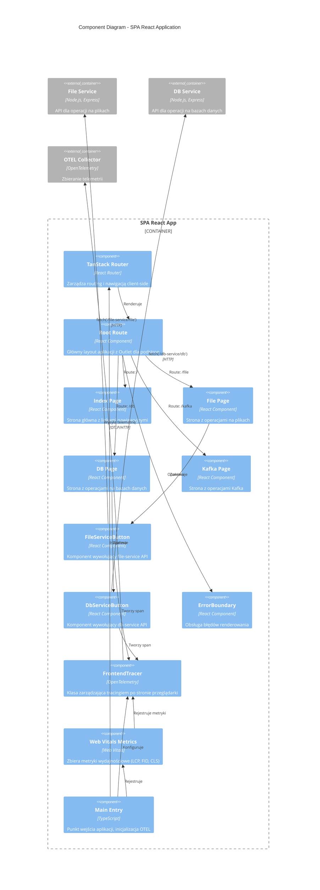
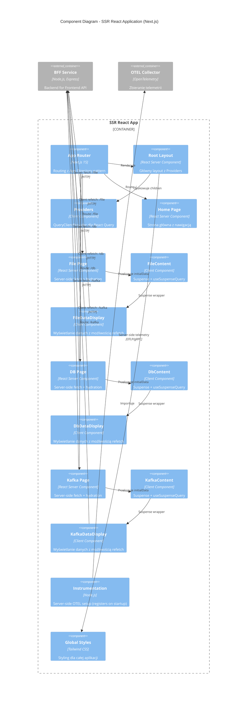
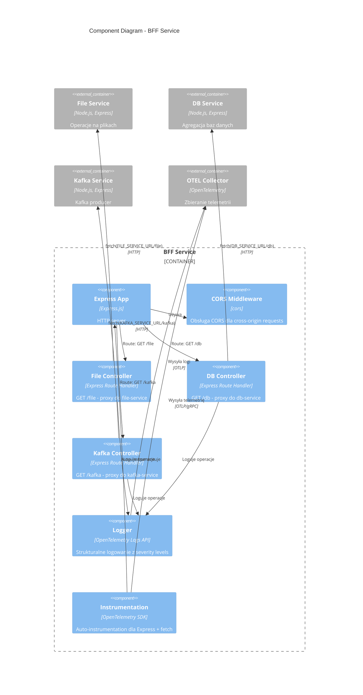
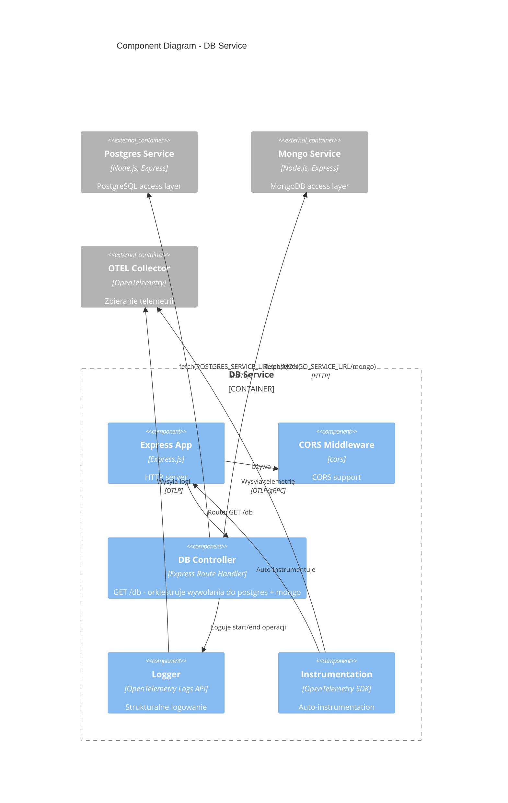

# C4 Model - Level 3: Component Diagram

## Przegląd

Diagram komponentów przedstawia wewnętrzną strukturę wybranych kontenerów, pokazując główne komponenty logiczne i ich odpowiedzialności.

## Diagram 1: SPA React App - Components

## Diagram 2: SSR React App (Next.js) - Components

## Diagram 3: BFF Service - Components

## Diagram 4: DB Service - Components

## Kluczowe Komponenty i Odpowiedzialności

### SPA React App

#### Routing & Navigation
- **TanStack Router**: File-based routing, type-safe routes
- **Root Route**: Layout wrapper z `<Outlet />` dla renderowania podstron
- **Pages**: Komponenty stron dla każdej ścieżki (/, /file, /db, /kafka)

#### Business Components
- **FileServiceButton**: Wywołuje API file-service, wyświetla response
- **DbServiceButton**: Wywołuje API db-service, wyświetla response
- **ErrorBoundary**: Łapie błędy renderowania React

#### Observability
- **FrontendTracer**: Klasa inicjalizująca OTEL Web SDK
  - Konfiguruje TracerProvider z WebTracerProvider
  - Rejestruje instrumentation (DocumentLoad, XMLHttpRequest, Fetch)
  - Eksportuje spany do OTEL Collector przez OTLP/HTTP
  - Propaguje `traceparent` header w requestach
- **Web Vitals Metrics**: Zbiera CWV (LCP, FID, CLS, FCP, TTFB)

### SSR React App (Next.js)

#### App Router Architecture
- **App Router**: Next.js 15 routing z App Directory
- **Root Layout**: Server Component z Providers i global styles
- **Providers**: Client Component wrapper dla QueryClientProvider

#### Page Architecture (per route)
1. **Server Component (Page)**: 
   - Wykonuje server-side fetch do BFF
   - Przekazuje initialData do Client Component
   - Umożliwia SSR + SEO
2. **Client Component (Content)**:
   - Używa Suspense dla loading state
   - Zawiera DataDisplay component
3. **Client Component (DataDisplay)**:
   - useSuspenseQuery z initialData
   - Umożliwia client-side refetch
   - Wyświetla JSON response

#### Observability
- **Instrumentation**: Server-side OTEL setup
  - Automatyczna instrumentacja Node.js
  - HTTP, fetch, Express auto-instrumentation
  - Eksport do OTEL Collector przez OTLP/gRPC

### BFF Service

#### HTTP Layer
- **Express App**: HTTP server na porcie 8087
- **CORS Middleware**: Umożliwia cross-origin requests z frontendów

#### Controllers (Route Handlers)
- **File Controller**: Proxy GET /file → file-service
- **DB Controller**: Proxy GET /db → db-service
- **Kafka Controller**: Proxy GET /kafka → kafka-service

Każdy controller:
- Loguje start/end operacji z timestampem
- Mierzy czas wykonania (endTime - startTime)
- Obsługuje błędy i zwraca odpowiednie status codes
- Automatycznie instrumentowany przez OTEL

#### Observability
- **Logger**: OTEL Logs API z severity levels (INFO, ERROR)
- **Instrumentation**: Auto-instrumentation Express + HTTP + fetch

### DB Service

#### Orchestration
- **DB Controller**: Orkiestruje równoległe wywołania do:
  - postgres-service (GET /postgres)
  - mongo-service (GET /mongo)
- Agreguje wyniki w jeden response: `{ mongo: {...}, postgres: {...} }`

#### Observability
- Logger z szczegółowymi eventami (starting to read from MongoDB, etc.)
- Auto-instrumentation tworzy spany dla każdego fetch

## Wzorce Projektowe

1. **Composition Pattern**: Root Layout + Pages + Components
2. **Server Component + Client Component**: Optymalizacja Next.js (SSR + interactivity)
3. **Suspense Pattern**: Async data loading z fallback UI
4. **Proxy Pattern**: BFF jako proxy dla backend services
5. **Anti-corruption Layer**: Postgres/Mongo services izolują szczegóły implementacyjne
6. **Observer Pattern**: OpenTelemetry jako observer dla wszystkich operacji
7. **Error Boundary Pattern**: Graceful error handling w React

## Data Flow

### SPA React (Client-Side)
1. User click → Component handler
2. Component → fetch API → Service
3. Service response → Component state update
4. FrontendTracer → create span → OTEL Collector

### SSR React (Hybrid)
1. **Server-Side**: Page component → fetch BFF → initialData
2. **Hydration**: Client otrzymuje pre-rendered HTML + initialData
3. **Client-Side**: User click refetch → useSuspenseQuery → BFF
4. Server instrumentation → spans → OTEL Collector

### BFF Orchestration
1. SSR request → BFF controller
2. BFF → fetch downstream service
3. Service response → BFF response
4. Logger emits + instrumentation creates spans

### DB Service Orchestration
1. Request → db controller
2. Parallel fetch → postgres-service + mongo-service
3. Aggregate responses
4. Return combined JSON
