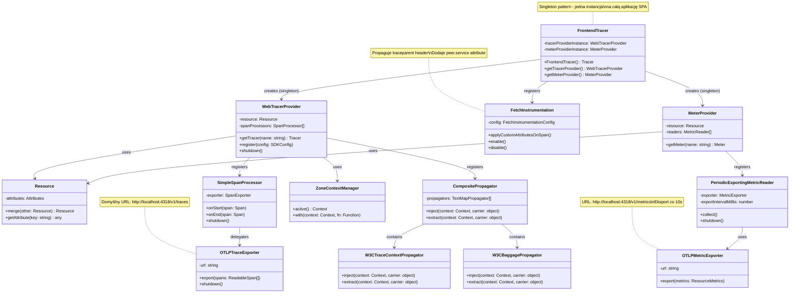

# C4 Model - Level 4: Code Diagram

## Przegląd

Diagram kodu przedstawia szczegóły implementacyjne kluczowych komponentów, pokazując klasy, metody i zależności na poziomie kodu źródłowego.

## Diagram 1: SPA React - Frontend Tracer (OpenTelemetry Setup)



## Diagram 2: SSR React - Server-Side Instrumentation


## Diagram 3: FileServiceButton Component - Data Flow


## Diagram 4: SSR React - DbContent Component Flow


## Diagram 5: BFF Service - Controller Implementation


## Diagram 6: DB Service - Orchestration Logic

```mermaid
flowchart TD
    A[GET /db Request] --> B[Log: 'Received request']
    B --> C{Try}
    
    C --> D[Log: 'Starting MongoDB']
    D --> E[fetch MONGO_SERVICE_URL/mongo]
    
    C --> F[Log: 'Starting PostgreSQL']
    F --> G[fetch POSTGRES_SERVICE_URL/postgres]
    
    E --> H{Both Complete?}
    G --> H
    
    H -->|Success| I[Aggregate Responses]
    I --> J[Return JSON: {mongo, postgres}]
    
    H -->|Error| K[Log Error]
    K --> L[Return 500]
    
    J --> M[Instrumentation Creates Span]
    M --> N[Export to OTEL Collector]
    
    style A fill:#e1f5fe
    style J fill:#c8e6c9
    style L fill:#ffcdd2
    style N fill:#fff9c4
```

## Kluczowe Implementacje

### 1. FrontendTracer (SPA React)

```typescript
// Singleton pattern
let tracerProviderInstance: WebTracerProvider | null = null;
let meterProviderInstance: MeterProvider | null = null;

const FrontendTracer = () => {
    if (tracerProviderInstance) {
        return tracerProviderInstance.getTracer('example-tracer-web');
    }
    
    // Setup tracer provider
    const resource = resourceFromAttributes({
        [ATTR_SERVICE_NAME]: 'spa-react',
    });
    
    const tracerProvider = new WebTracerProvider({
        resource,
        spanProcessors: [new SimpleSpanProcessor(new OTLPTraceExporter())],
    });
    
    // Context propagation
    tracerProvider.register({
        contextManager: new ZoneContextManager(),
        propagator: new CompositePropagator({
            propagators: [
                new W3CBaggagePropagator(),
                new W3CTraceContextPropagator()
            ],
        }),
    });
    
    // Fetch instrumentation with custom attributes
    registerInstrumentations({
        tracerProvider,
        instrumentations: [
            new FetchInstrumentation({
                propagateTraceHeaderCorsUrls: [/.+/g],
                applyCustomAttributesOnSpan: (span, _request, response) => {
                    if (response instanceof Response) {
                        const service = response.url.split('/')[3];
                        span.setAttribute('peer.service', service);
                    }
                },
            }),
        ],
    });
    
    return webTracer;
};
```

**Kluczowe cechy:**
- Singleton dla całej aplikacji SPA
- Automatyczne propagowanie `traceparent` header
- Custom attribute `peer.service` dla lepszej identyfikacji targetów
- Zone.js context manager dla async operations
- Export co 10s dla metryk

### 2. SSR Instrumentation (Next.js)

```typescript
export async function register() {
    if (process.env.NEXT_RUNTIME === 'nodejs') {
        const resource = Resource.default().merge(
            new Resource({
                [SEMRESATTRS_SERVICE_NAME]: 'ssr-react',
                [SEMRESATTRS_SERVICE_VERSION]: '1.0.0',
                'service.namespace': 'frontend',
            }),
        );
        
        const sdk = new NodeSDK({
            resource,
            traceExporter: new OTLPTraceExporter({
                url: 'http://localhost:4318/v1/traces',
            }),
            metricReader: new PeriodicExportingMetricReader({
                exporter: new OTLPMetricExporter({
                    url: 'http://localhost:4318/v1/metrics',
                }),
            }),
            instrumentations: [
                new HttpInstrumentation({
                    ignoreIncomingRequestHook: (req) => {
                        return req.url?.includes('_next') || 
                               req.url?.includes('favicon') || 
                               req.url === '/health';
                    },
                }),
            ],
        });
        
        sdk.start();
        
        // Graceful shutdown
        process.on('SIGTERM', () => {
            sdk.shutdown()
                .then(() => console.log('OpenTelemetry terminated'))
                .finally(() => process.exit(0));
        });
    }
}
```

**Kluczowe cechy:**
- Automatyczne wywołanie przez Next.js przy starcie
- Filtrowanie requestów (_next, favicon, health)
- Graceful shutdown na SIGTERM
- Server-side only (check NEXT_RUNTIME)
- Semantic attributes dla namespace i instance ID

### 3. FileServiceButton Component

```typescript
const FileServiceButton = () => {
    const [response, setResponse] = useState<string | null>(null);
    
    const handleClick = async () => {
        setResponse(null);
        // FetchInstrumentation automatycznie tworzy span
        const response = await fetch('/file-service/file');
        const data = await response.json();
        setResponse(JSON.stringify(data, null, 2));
    };
    
    return (
        <div>
            <button onClick={handleClick}>
                Call single file service request
            </button>
            {response && <pre>{response}</pre>}
        </div>
    );
};
```

**Kluczowe cechy:**
- Prosta async operacja fetch
- Auto-instrumentation przez FetchInstrumentation
- State management dla loading/success states
- Wyświetlanie JSON response

### 4. BFF File Controller

```typescript
app.get('/file', async (req, res) => {
    const startTime = Date.now();
    
    logger.emit({
        severityNumber: SeverityNumber.INFO,
        body: 'Received request to read file through BFF',
    });
    
    try {
        const fileContent = await fetch(`${FILE_SERVICE_URL}/file`);
        const fileResponse = await fileContent.json();
        
        const endTime = Date.now();
        logger.emit({
            severityNumber: SeverityNumber.INFO,
            body: `File read through BFF successfully in ${endTime - startTime} ms`,
        });
        
        res.json(fileResponse);
    } catch (error) {
        logger.emit({
            severityNumber: SeverityNumber.ERROR,
            body: `Error reading file through BFF: ${error.message}`,
        });
        res.status(500).json({ status: 500, message: 'Error reading file' });
    }
});
```

**Kluczowe cechy:**
- Manual timing measurement (startTime/endTime)
- Structured logging z severity levels
- Error handling z try/catch
- Proxy pattern (forward request to downstream service)

## Design Patterns Użyte

1. **Singleton**: FrontendTracer provider instances
2. **Factory**: OTEL SDK setup functions
3. **Observer**: OpenTelemetry instrumentation observers
4. **Proxy**: BFF jako proxy dla backend services
5. **Decorator**: Instrumentation decoruje funkcje fetch/http
6. **Strategy**: Różne exportery (OTLP, Console) jako strategie
7. **Composite**: CompositePropagator zawiera multiple propagators

## Performance Considerations

1. **SimpleSpanProcessor vs BatchSpanProcessor**: 
   - SPA używa SimpleSpanProcessor dla immediate export
   - Production powinien używać BatchSpanProcessor

2. **Zone.js Context Manager**:
   - Zachowuje async context w Angular-like apps
   - Overhead dla każdego async operation

3. **Export Intervals**:
   - Metrics: 10s interval
   - Traces: Immediate (SimpleSpanProcessor)

4. **Resource Attributes**:
   - Statyczne (set once at startup)
   - Propagowane do wszystkich spans/metrics

## Security Considerations

1. **CORS Configuration**: Umożliwia cross-origin dla frontendów
2. **Header Propagation**: W3C Trace Context standard
3. **URL Filtering**: Ignorowanie sensitive paths (_next, health)
4. **Error Masking**: Nie eksponowanie stack traces w API responses
