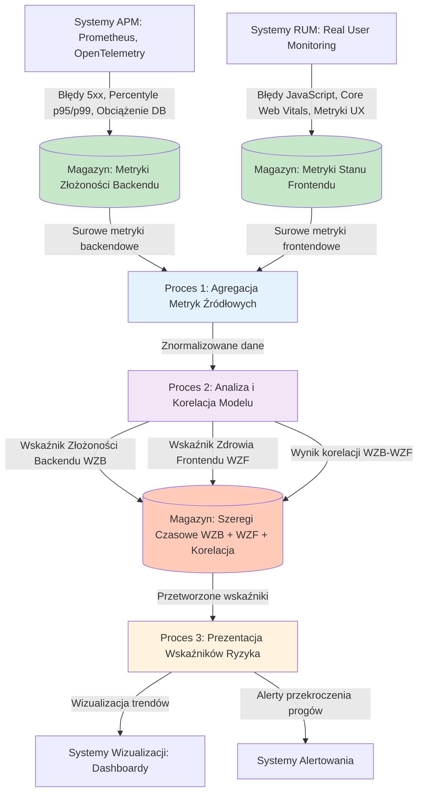
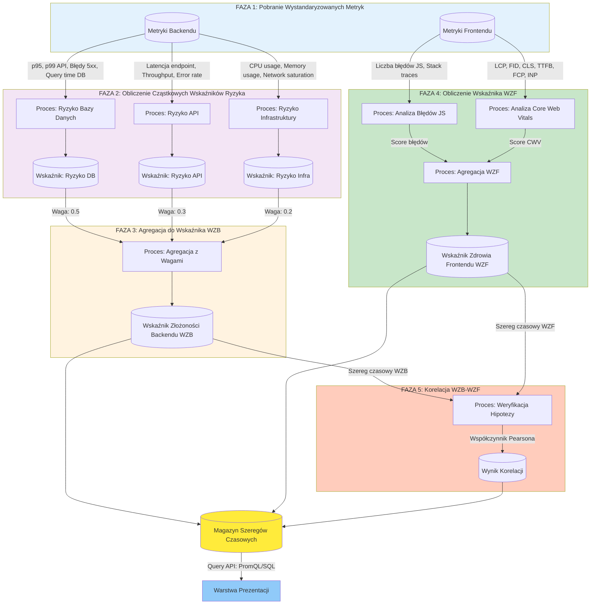
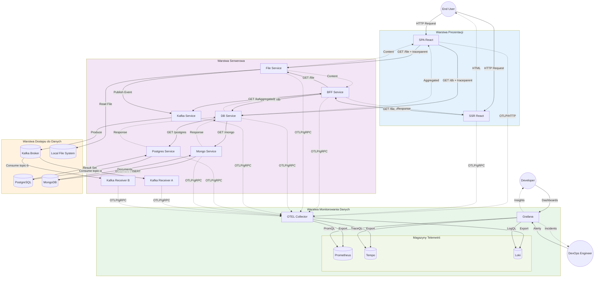
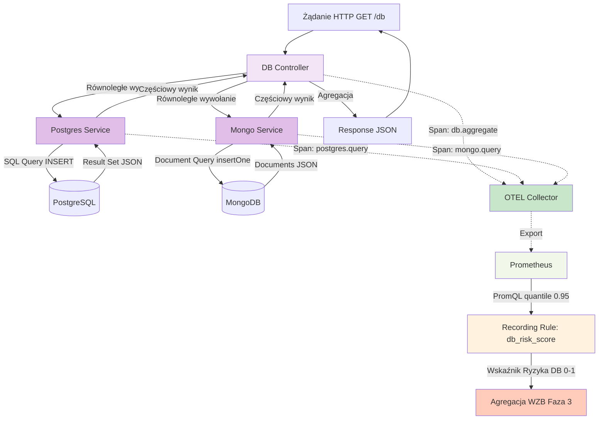
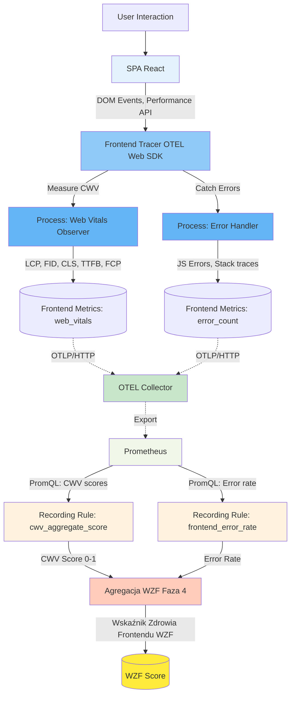

# Data Flow Diagram (DFD) – Model Systemu Monitorowania Mikrofrontendów

> Cel: Przedstawienie przepływu danych w systemie opartym o mikrofrontendy, obejmującym warstwę prezentacji, warstwę serwerową oraz warstwę dostępu do danych. Dokument prezentuje dwa warianty modelu: **model podstawowy** (bez warstwy monitorowania) oraz **model końcowy** (wzbogacony o warstwę monitorowania danych – metryki, logi, ślady telemetryczne).

## Wprowadzenie

W celu opracowania modelu monitorowania oraz weryfikacji jego skuteczności w środowisku możliwie zbliżonym do rzeczywistych warunków pracy zaawansowanych systemów informatycznych zastosowano notację DFD (Data Flow Diagram), umożliwiającą formalny i jednoznaczny opis przepływów oraz transformacji informacji w systemie.

### Legendy i Konwencje
- **Prostokąt** = Proces / System / Serwis
- **Zaokrąglony prostokąt** = Aktor zewnętrzny
- **Cylindry / Równoległe prostokąty** = Repozytoria danych / Broker
- **Linia z etykietą** = Przepływ danych (nazwa / typ / kierunek)
- **Etykiety danych** zawierają nazwy logiczne, bez danych osobowych (PII)

---

## Model Ogólny – Przepływ Danych w Systemie Monitorowania (Rys. X)

Model ogólny przedstawia procesowy model monitorowania warstwy frontendowej, bazujący na danych zebranych z warstwy backendowej. Model składa się z trzech głównych procesów odpowiedzialnych za agregację, analizę i prezentację wskaźników ryzyka.



### Opis Modelu Ogólnego

**Proces 1: Agregacja Metryk Źródłowych**
- Zbieranie i normalizacja danych z systemów monitorujących obie warstwy aplikacji
- Równoległe pobieranie danych z dwóch odrębnych źródeł:
  - **Metryki Złożoności Backendu** – dane z APM (Prometheus, OpenTelemetry): błędy 5xx, percentyle p95/p99 czasu odpowiedzi API, obciążenie bazy danych
  - **Metryki Stanu Frontendu** – dane z RUM i systemów śledzenia błędów: błędy JavaScript, Core Web Vitals

**Proces 2: Analiza i Korelacja Modelu**
- Rdzeń systemu, przetwarzający surowe dane przez logikę modelu
- Transformacja metryk z przypisaniem wag (np. opóźnienie DB ma większy wpływ niż użycie CPU)
- Obliczanie zagregowanych wskaźników:
  - **WZB** (Wskaźnik Złożoności Backendu)
  - **WZF** (Wskaźnik Zdrowia Frontendu)
- Korelacja WZB ↔ WZF – weryfikacja hipotezy o wpływie złożoności backendu na UX

**Proces 3: Prezentacja Wskaźników Ryzyka**
- Proces końcowy udostępniający przetworzone dane
- Wizualizacja trendów na dashboardach
- Generowanie alertów przy przekroczeniu progów

**Magazyny Danych:**
- **Metryki Złożoności Backendu** – surowe dane z warstwy serwerowej
- **Metryki Stanu Frontendu** – surowe dane z warstwy prezentacji
- **Szeregi Czasowe** – przetworzone wskaźniki WZB, WZF i wyniki korelacji

---

## Model Szczegółowy – Automatyczny Proces Obliczania Wskaźników (Rys. Y)

Model szczegółowy definiuje kluczowe metryki oraz logikę korelacji w ramach procesu analizy. Przedstawia pięciofazowy proces obliczania wskaźników WZB (Wskaźnik Złożoności Backendu) i WZF (Wskaźnik Zdrowia Frontendu) oraz ich korelacji.



### Opis Modelu Szczegółowego

**Faza 1: Pobranie Wystandaryzowanych Metryk**
- Pobieranie znormalizowanych danych z magazynów metryk backendowych i frontendowych
- Filtracja i przygotowanie danych wejściowych dla dalszych faz

**Faza 2: Obliczenie Cząstkowych Wskaźników Ryzyka**
Równoległe obliczanie wskaźników dla poszczególnych komponentów backendu:
- **Ryzyko Bazy Danych** – bazujące na percentylach p95/p99 czasu zapytań, liczbie timeout'ów
- **Ryzyko API** – bazujące na latencji endpoint'ów, throughput, error rate (5xx)
- **Ryzyko Infrastruktury** – bazujące na wykorzystaniu CPU, pamięci, nasyceniu sieci

**Faza 3: Agregacja do Syntetycznego WZB**
- Agregacja cząstkowych wskaźników z przypisanymi wagami
- **Wagi:**
  - Ryzyko DB: 0.5 (wysokie opóźnienie DB ma największy wpływ na UX)
  - Ryzyko API: 0.3 (średni wpływ)
  - Ryzyko Infrastruktury: 0.2 (niski bezpośredni wpływ)
- **Formuła:** `WZB = 0.5 × R_DB + 0.3 × R_API + 0.2 × R_INF`

**Faza 4: Obliczenie Wskaźnika Zdrowia Frontendu (WZF)**
Równoległe procesy analizy:
- **Analiza Błędów JavaScript** – liczba błędów, ich częstotliwość, krityczność (stack trace analysis)
- **Analiza Core Web Vitals** – agregacja metryk LCP, FID, CLS, TTFB, FCP, INP
- **Agregacja WZF** – obliczenie syntetycznego wskaźnika zdrowia na podstawie obu źródeł

**Faza 5: Korelacja WZB ↔ WZF**
- **Cel:** Weryfikacja hipotezy, czy wzrost złożoności/obciążenia backendu (WZB) ma bezpośrednie przełożenie na degradację doświadczenia użytkownika (WZF)
- **Metody:**
  - Współczynnik korelacji Pearsona między szeregami czasowymi WZB[t] i WZF[t]
  - Lag analysis – sprawdzenie opóźnienia między wzrostem WZB a spadkiem WZF
  - Threshold crossing detection – identyfikacja momentów jednoczesnego przekroczenia progów
- **Wynik:** Współczynnik korelacji + interpretacja (silna/średnia/słaba zależność)

**Magazyn Szeregów Czasowych:**
- Przechowuje historyczne wartości WZB, WZF oraz wyników korelacji
- Umożliwia analizę trendów i długoterminową diagnostykę
- Źródło danych dla dashboardów i systemów alertowania

---

## Model Implementacyjny – Architektura Systemu Weryfikacyjnego

Poniższy model przedstawia implementację opracowanego modelu procesowego w środowisku weryfikacyjnym, obejmującym rzeczywiste komponenty systemu (mikrofrontendy, serwisy backendowe, warstwy danych oraz pełny stos observability).



### Opis Modelu Implementacyjnego

Model implementacyjny mapuje procesy z modelu ogólnego (Rys. X) na konkretne komponenty środowiska weryfikacyjnego:

**Mapowanie: Proces 1 (Agregacja Metryk) → OTEL Collector**
- OTEL Collector pełni rolę centralnego punktu agregacji metryk z obu warstw
- Zbiera dane OTLP (gRPC/HTTP) ze wszystkich komponentów systemu
- Normalizuje i wzbogaca telemetrię (service.name, version, environment)

**Mapowanie: Proces 2 (Analiza i Korelacja) → Prometheus + Grafana**
- **Prometheus** przechowuje szeregi czasowe metryk (odpowiednik magazynu z Fazy 1-3 modelu szczegółowego)
- **Grafana** realizuje logikę korelacji poprzez:
  - Zapytania PromQL obliczające WZB (agregacja metryk DB + API + Infra)
  - Zapytania do RUM/Tempo obliczające WZF (błędy JS + CWV)
  - Dashboardy prezentujące korelację WZB ↔ WZF w czasie rzeczywistym

**Mapowanie: Proces 3 (Prezentacja Wskaźników) → Grafana Dashboards & Alerts**
- Wizualizacja wskaźników WZB i WZF na dedykowanych dashboardach
- Reguły alertowe dla przekroczeń progów (alert quando WZB > 0.7 i WZF < 0.5)
- Runbook'i dla scenariuszy degradacji

**Źródła Danych Implementacyjne:**
- **Metryki Złożoności Backendu:** instrumentacja OTEL w services (DB, File, BFF, Kafka, Postgres, Mongo)
- **Metryki Stanu Frontendu:** instrumentacja OTEL Web SDK w SPA/SSR (błędy JS, Core Web Vitals)

**Weryfikacja Modelu:**
Środowisko umożliwia empiryczną weryfikację hipotezy:
1. Symulacja obciążenia backendu (np. spowolnienie Postgres)
2. Obserwacja wzrostu WZB (poprzez metryki `db_query_duration_seconds`)
3. Monitoring wpływu na WZF (poprzez metryki `frontend_action_duration_seconds`, `error_count`)
4. Analiza korelacji w dashboardzie Grafana

---

---

## Relacja Między Modelami

Poniższa tabela przedstawia powiązania między modelem ogólnym (Rys. X), modelem szczegółowym (Rys. Y) oraz modelem implementacyjnym.

| Element Modelu Ogólnego | Element Modelu Szczegółowego | Implementacja w Systemie Weryfikacyjnym |
|-------------------------|------------------------------|----------------------------------------|
| **Proces 1: Agregacja Metryk Źródłowych** | Faza 1: Pobranie Wystandaryzowanych Metryk | OTEL Collector (receivers + processors) |
| Magazyn: Metryki Złożoności Backendu | Metryki backendowe (p95, p99, 5xx, DB load) | Prometheus TSDB + Tempo traces + Loki logs |
| Magazyn: Metryki Stanu Frontendu | Metryki frontendowe (JS errors, CWV) | Prometheus TSDB (frontend metrics) |
| **Proces 2: Analiza i Korelacja** | Faza 2-5: Obliczenia WZB, WZF, Korelacja | Grafana (PromQL queries + dashboards) |
| Logika przypisania wag | Faza 3: Agregacja z wagami (DB: 0.5, API: 0.3, Infra: 0.2) | Recording rules w Prometheus |
| Obliczenie WZB | Faza 3: Syntetyczny wskaźnik | `wzb = 0.5*db_risk + 0.3*api_risk + 0.2*infra_risk` |
| Obliczenie WZF | Faza 4: Analiza błędów JS + CWV | `wzf = f(error_rate, cwv_score)` |
| Korelacja WZB ↔ WZF | Faza 5: Weryfikacja hipotezy | Dashboard z wykresami WZB[t] vs WZF[t] + correlation panel |
| **Proces 3: Prezentacja Wskaźników** | Magazyn szeregów czasowych + Warstwa prezentacji | Grafana dashboards + alert rules + notification channels |
| Systemy wizualizacji | Dashboard WZB/WZF | Executive Dashboard + Service Drill-Down |
| Systemy alertowania | Alert rules | Alert: `WZB > 0.7 AND WZF < 0.5` → Slack/Email |

---

## Kluczowe Różnice: Model Ogólny vs Model Szczegółowy vs Model Implementacyjny

| Aspekt | Model Ogólny (Rys. X) | Model Szczegółowy (Rys. Y) | Model Implementacyjny |
|--------|----------------------|----------------------------|----------------------|
| **Poziom abstrakcji** | Wysoki (procesy koncepcyjne) | Średni (fazy algorytmu) | Niski (konkretne komponenty) |
| **Cel** | Zrozumienie ogólnego przepływu | Definicja logiki obliczeń | Weryfikacja empiryczna |
| **Elementy** | 3 procesy + magazyny | 5 faz + wskaźniki cząstkowe | Komponenty techniczne (OTEL, Prometheus, Grafana) |
| **Wagi metryk** | Ogólna wzmianka | Konkretne wartości (0.5/0.3/0.2) | Recording rules PromQL |
| **Korelacja** | Proces black-box | Algorytm z lag analysis | Dashboard z real-time korelacją |
| **Odbiorcy** | Stakeholders, architekci | Zespół implementacyjny | DevOps, QA, Developer |

---

## Kluczowe Encje Danych w Modelach

Poniższa tabela mapuje encje danych występujące w modelach procesowych na rzeczywiste struktury danych w implementacji.

| Encja (Model Ogólny/Szczegółowy) | Opis | Implementacja | Format Danych |
|----------------------------------|------|---------------|---------------|
| **Metryki Złożoności Backendu** | Błędy 5xx, p95/p99 API, obciążenie DB | Prometheus metrics | `http_request_duration_seconds{quantile="0.95"}`, `db_query_duration_seconds` |
| **Metryki Stanu Frontendu** | Błędy JS, Core Web Vitals | Prometheus metrics + Tempo spans | `frontend_error_count`, `web_vitals_lcp_seconds` |
| **Wskaźnik Ryzyka DB** | Cząstkowy wskaźnik (Faza 2) | PromQL recording rule | `db_risk = rate(db_errors[5m]) + quantile(0.95, db_duration)` |
| **Wskaźnik Ryzyka API** | Cząstkowy wskaźnik (Faza 2) | PromQL recording rule | `api_risk = rate(http_5xx[5m]) + quantile(0.95, http_duration)` |
| **Wskaźnik Ryzyka Infrastruktury** | Cząstkowy wskaźnik (Faza 2) | PromQL recording rule | `infra_risk = cpu_usage + memory_usage` |
| **WZB** | Wskaźnik Złożoności Backendu | Grafana variable / PromQL | `0.5*db_risk + 0.3*api_risk + 0.2*infra_risk` |
| **WZF** | Wskaźnik Zdrowia Frontendu | Grafana variable / PromQL | `(1 - error_rate) * cwv_score` |
| **Wynik Korelacji** | Współczynnik Pearsona, lag | Grafana stat panel | Correlation coefficient (np. 0.78) |
| **Szereg Czasowy** | Historia WZB[t], WZF[t] | Prometheus TSDB | Time-series z resolution 15s |

---
## Szczegółowe Przepływy w Modelu Implementacyjnym (DFD Poziom 1)

Poniższe diagramy przedstawiają szczegółowe przepływy dla kluczowych procesów w środowisku weryfikacyjnym, ilustrujące sposób implementacji faz z modelu szczegółowego (Rys. Y).

### 1A. Proces Obliczania Wskaźnika Ryzyka Bazy Danych (Faza 2 - DB Risk)



**Implementacja Fazy 2 (Ryzyko DB):**
- **Metryki źródłowe:** `db_query_duration_seconds{backend="postgres|mongo"}`
- **Recording rule (PromQL):**
  ```promql
  db_risk_score = (
    histogram_quantile(0.95, rate(db_query_duration_seconds_bucket[5m])) / 1.0
  ) + (
    rate(db_query_errors_total[5m]) * 10
  )
  ```
- **Interpretacja:** Wskaźnik ryzyka = latencja p95 znormalizowana + error rate × 10
- **Zakres:** 0 (brak ryzyka) do 1+ (wysokie ryzyko)
- **Przekazanie do Fazy 3:** Wartość `db_risk_score` używana z wagą 0.5 w obliczeniu WZB

### 1B. Proces Zbierania Metryk Frontendowych (Faza 4 - WZF Input)



**Implementacja Fazy 4 (WZF):**
- **Metryki źródłowe:**
  - `web_vitals_lcp_seconds`, `web_vitals_fid_seconds`, `web_vitals_cls_ratio`
  - `frontend_error_count`, `frontend_request_duration_seconds`
  
- **Recording rules:**
  ```promql
  # CWV Aggregate Score (normalized 0-1, higher = better)
  cwv_aggregate_score = (
    (1 - clamp_max(web_vitals_lcp_seconds / 4.0, 1)) * 0.4 +
    (1 - clamp_max(web_vitals_fid_seconds / 0.3, 1)) * 0.3 +
    (1 - clamp_max(web_vitals_cls_ratio / 0.25, 1)) * 0.3
  )
  
  # Error Rate
  frontend_error_rate = rate(frontend_error_count[5m])
  
  # WZF (0-1, higher = healthier)
  wzf_score = cwv_aggregate_score * (1 - clamp_max(frontend_error_rate * 100, 1))
  ```

- **Interpretacja:**
  - WZF = 1.0 → Idealny (CWV doskonałe, brak błędów)
  - WZF = 0.7-0.9 → Dobry
  - WZF = 0.5-0.7 → Ostrzeżenie
  - WZF < 0.5 → Krytyczny (degradacja UX)

### 1C. Proces Korelacji WZB ↔ WZF (Faza 5)

```mermaid
flowchart LR
    WZB_TS[("Prometheus TSDB: WZB(t)")]
    WZF_TS[("Prometheus TSDB: WZF(t)")]
    
    WZB_TS -->|"Query: range_query last 1h"| GRAF["Grafana Dashboard"]
    WZF_TS -->|"Query: range_query last 1h"| GRAF
    
    GRAF -->|"Panel 1: Time Series"| VIZ1["Wizualizacja: WZB vs WZF"]
    GRAF -->|"Panel 2: Stat"| VIZ2["Alert Status"]
    GRAF -->|"Panel 3: Correlation"| VIZ3["Correlation Coefficient"]
    
    VIZ3 -->|"r > 0.7"| INTERP_HIGH["Interpretacja: Silna korelacja"]
    VIZ3 -->|"0.3 < r < 0.7"| INTERP_MED["Interpretacja: Srednia korelacja"]
    VIZ3 -->|"r < 0.3"| INTERP_LOW["Interpretacja: Slaba korelacja"]
    
    INTERP_HIGH --> ACTION["Akcja: Alert + Runbook"]
    VIZ2 --> ACTION
    
    style WZB_TS fill:#ffccbc
    style WZF_TS fill:#ffccbc
    style GRAF fill:#90caf9
    style VIZ1 fill:#e3f2fd
    style VIZ2 fill:#e3f2fd
    style VIZ3 fill:#e3f2fd
    style INTERP_HIGH fill:#c8e6c9
    style ACTION fill:#ffeb3b
```**Implementacja Fazy 5 (Korelacja):**
- **Źródło danych:** Prometheus range queries dla WZB i WZF (ostatnia 1h, resolution 15s)
- **Dashboard Grafana - Panel Konfiguracja:**
  ```json
  {
    "title": "WZB ↔ WZF Correlation",
    "type": "timeseries",
    "targets": [
      { "expr": "wzb_score", "legendFormat": "WZB" },
      { "expr": "wzf_score", "legendFormat": "WZF" }
    ],
    "transformations": [
      {
        "id": "calculateField",
        "options": {
          "mode": "reduceRow",
          "reduce": { "reducer": "correlation" }
        }
      }
    ]
  }
  ```
- **Alert Rule:**
  ```yaml
  alert: HighBackendComplexityDegradingUX
  expr: wzb_score > 0.7 and wzf_score < 0.5
  for: 5m
  annotations:
    summary: "Wysoka złożoność backendu (WZB={{ $value }}) degraduje UX (WZF={{ $value }})"
    runbook_url: "https://wiki/runbooks/wzb-wzf-correlation"
  ```
  
- **Lag Analysis (opcjonalnie):**
  - Offset query: `wzb_score offset 1m` vs `wzf_score` → sprawdza czy WZB wyprzedza WZF o 1 minutę
  - Time shift transformation w Grafana

---
---

## Podsumowanie Modeli DFD

Przedstawione modele DFD tworzą spójny obraz procesu budowy i weryfikacji modelu monitorowania warstwy frontendowej opartego na danych z warstwy backendowej:

1. **Model Ogólny (Rys. X)** – definiuje trzy główne procesy na poziomie koncepcyjnym:
   - Agregacja metryk źródłowych z APM i RUM
   - Analiza i korelacja z obliczeniem WZB i WZF
   - Prezentacja wskaźników ryzyka w systemach wizualizacji i alertowania

2. **Model Szczegółowy (Rys. Y)** – rozbija proces analizy na pięć faz algorytmicznych:
   - Faza 1: Pobranie wystandaryzowanych metryk
   - Faza 2: Obliczenie cząstkowych wskaźników ryzyka (DB, API, Infra)
   - Faza 3: Agregacja do syntetycznego WZB (z wagami: 0.5, 0.3, 0.2)
   - Faza 4: Obliczenie WZF (błędy JS + Core Web Vitals)
   - Faza 5: Korelacja WZB ↔ WZF i weryfikacja hipotezy

3. **Model Implementacyjny** – mapuje procesy i fazy na konkretne komponenty środowiska weryfikacyjnego:
   - OTEL Collector jako punkt agregacji
   - Prometheus jako magazyn szeregów czasowych
   - Recording rules dla obliczania wskaźników
   - Grafana jako platforma analizy i wizualizacji korelacji

4. **Szczegółowe Przepływy (Poziom 1)** – ilustrują implementację kluczowych faz:
   - Proces obliczania DB Risk Score (Faza 2)
   - Proces zbierania metryk frontendowych (Faza 4)
   - Proces korelacji z dashboard'em i alertami (Faza 5)

### Wnioski z Modeli

Opracowane modele DFD umożliwiają:
- **Formalny opis** przepływu i transformacji danych w systemie monitorowania
- **Weryfikowalność** – każdy proces i magazyn ma odpowiednik w implementacji
- **Testowalność** – możliwość empirycznej weryfikacji hipotezy o korelacji WZB ↔ WZF
- **Reprodukowalność** – szczegółowe formuły PromQL pozwalają na odtworzenie eksperymentu

Model stanowi fundament dla dalszej oceny przydatności podejścia w rzeczywistych warunkach produkcyjnych.

| Encja | Opis | Źródło | Konsumenci | Rola w Monitoringu |
|-------|------|--------|------------|--------------------|
| **UserRequest** | Parametry i nagłówki żądania HTTP (+ traceparent) | Frontend (SPA/SSR) | Backend Services | Propagacja kontekstu śledzenia |
| **FileContent** | Treść pliku tekstowego + metadane (rozmiar, timestamp) | File Service + Local FS | Frontend (prezentacja) | Metryka: file_size_bytes, czas odczytu |
| **AggregatedDBData** | Połączone dane z PostgreSQL i MongoDB | DB Service (agregator) | Frontend, BFF | Ślad kompozycji: dependency spans |
| **EventMessage** | Wiadomość JSON dla komunikacji asynchronicznej | File/DB/Kafka Service | Kafka Receivers A/B | Metryka: kafka_consumer_lag, data_freshness |
| **TraceSpan** | Ślad operacji: traceId, spanId, duration, attributes | Instrumentacja OTEL (wszystkie komponenty) | Tempo, Grafana | Analiza latencji, distributed tracing |
| **MetricSeries** | Szereg czasowy: liczniki, histogramy, gauge | Wszystkie komponenty | Prometheus, Grafana | SLI/SLO, alerty, dashboardy |
| **LogRecord** | Strukturalny log zdarzenia: timestamp, severity, body | Wszystkie komponenty | Loki, Grafana | Diagnostyka błędów, audyt |
| **ConsumerProcessedEvent** | Przetworzona wiadomość z Kafka + timestamp | Kafka Receiver A/B | Metryki świeżości | Kalkulacja: now() - event.timestamp |

---

## Atrybuty i Ograniczenia Danych

**Polityka Danych:**
- **Brak PII** w metrykach i labelach (zgodnie z GDPR)
- **Rozdzielenie domeny:** prefiksy `frontend_`, `http_`, `db_`, `kafka_` dla metryk
- **Kontrola kardynalności:** ≤ 200 kombinacji etykiet na metrykę
- **Propagacja kontekstu:** W3C Trace Context (`traceparent` header) przez wszystkie warstwy

**Dozwolone Etykiety (Label Keys):**
- `service`, `route`, `method`, `status_class`, `instance`, `version`
- `environment`, `mf_name` (opcjonalny), `topic`, `partition`
- `db_op`, `table`, `collection`

**Zabronione Etykiety Dynamiczne:**
- `trace_id`, `user_id`, `full_url`, `payload_hash`

---

## Reguły Degradacji i Wpływ na Przepływy

Model końcowy uwzględnia scenariusze degradacji, które wpływają na przepływy danych i telemetrię:

### Scenariusz 1: Awaria Jednej Bazy Danych
- **Symptom:** Postgres niedostępny, Mongo działa
- **Przepływ:** DB Service → timeout na Postgres Service → częściowa odpowiedź
- **Telemetria:** Span z statusem ERROR, metryka `db_query_errors_total{backend="postgres"}` ↑
- **Wpływ na SLI:** Dostępność DB Service degradowana (częściowy sukces)

### Scenariusz 2: Kafka Consumer Lag
- **Symptom:** Kafka Receiver A przetwarza wolniej niż producent
- **Przepływ:** Kafka Broker → Consumer A (backlog rośnie)
- **Telemetria:** `kafka_consumer_lag{topic,partition}` ↑, `data_freshness_seconds` ↑
- **Wpływ na SLI:** Świeżość danych (freshness SLI), ale nie API availability

### Scenariusz 3: Utrata Eksportu Telemetrii
- **Symptom:** OTEL Collector → Prometheus niedostępny
- **Przepływ:** Telemetria buforowana w Collector, następnie drop przy przepełnieniu
- **Wpływ:** Ślepa strefa (MTTD ↑), brak alertów, ale żądania biznesowe nieprzerwane

---

## Potencjalne Punkty Pomiaru (Anchory w DFD)

Tabela przedstawia kluczowe punkty w przepływach danych, gdzie dokonywane są pomiary telemetryczne.

| Punkt Pomiaru | Metryka / Dane | Cel | Przepływ DFD |
|---------------|----------------|-----|--------------|
| **Frontend Request Start** | `frontend_action_duration_seconds` | Latencja UX end-to-end | User → SPA/SSR |
| **DB Parallel Fetch** | `db_query_duration_seconds{backend}` | Identyfikacja wolnego źródła | DB Service → Postgres/Mongo Service |
| **File Read** | `file_read_duration_seconds`, `file_size_bytes` | Wydajność I/O | File Service → Local FS |
| **Kafka Publish** | `kafka_publish_duration_seconds` | Jakość async path | Service → Kafka Broker |
| **Consumer Lag** | `kafka_consumer_lag{topic,partition}` | Świeżość danych | Kafka Broker → Receiver |
| **Data Freshness** | `data_freshness_seconds{consumer}` | SLA fresh data | Receiver processing |
| **Error Rate** | `http_request_errors_total{service,route}` | Availability SLI | Wszystkie HTTP services |
| **Span Duration** | Histogram w Tempo | Distributed tracing | End-to-end przez warstwy |

---

## Użyteczność DFD w Kontekście C4

| Model | Perspektywa | Zastosowanie |
|-------|-------------|--------------|
| **C4** | Struktura statyczna (komponenty, kontenery, relacje) | Architektura, deployment, technologie |
| **DFD** | Przepływy dynamiczne (dane, transformacje, magazyny) | Runtime behavior, telemetria, diagnostyka |
| **Połączenie** | Pełny obraz | C4 pokazuje "co", DFD pokazuje "jak dane płyną" |

**Synergiczny efekt:**
- C4 Level 2 (Container) + DFD Level 0 (Context) → pełna mapa systemu
- C4 Level 3 (Component) + DFD Level 1 (Szczegóły) → implementacja monitoringu

---

## Założenia Upraszczające

1. **Plik w File Service:** Prosty zasób w lokalnym FS, brak wersjonowania ani replikacji
2. **DB Service Response:** Zawsze agreguje dwa źródła równolegle, brak fallback logic (do przyszłej iteracji)
3. **Telemetria:** Eksport pełnej fidelity (brak sampling w modelu koncepcyjnym)
4. **Środowisko:** Wszystko lokalnie w Docker Compose, brak zewnętrznych zależności
5. **Bezpieczeństwo:** Trust domain ograniczona do bridge network, brak TLS między kontenerami

---

## Kierunki Rozszerzeń Modelu

**Model Podstawowy → Model Końcowy (zrealizowane):**
- ✅ Dodanie warstwy monitorowania (OTEL, Prometheus, Tempo, Loki, Grafana)
- ✅ Propagacja kontekstu (`traceparent` header)
- ✅ Definicja kluczowych metryk i śladów

**Przyszłe rozszerzenia (Model Końcowy → Model Zaawansowany):**
- DFD Level 2 dla ścieżek degradacji (circuit breaker states, fallback logic)
- Włączenie modelu złożonej dostępności (kompozycja SLI z wielu źródeł)
- Przepływy walidacji metryk (CI/CD integration, linter dla kardynalności)
- Health checks i readiness probes jako odrębne przepływy
- Model kosztów telemetrii (cardinality budget, retention impact)

---

**Autor:** Łukasz Ciskowski  
**Wersja:** 2.0 (model ogólny + model szczegółowy + model implementacyjny)  
**Data:** 2025-11-16  
**Status:** Final – gotowy do włączenia do pracy magisterskiej (Rozdział 2.1)

---
