# Diagramy Architektoniczne - Model Monitorowania Mikrofrontendów

## 1. Diagram Architektury Systemu

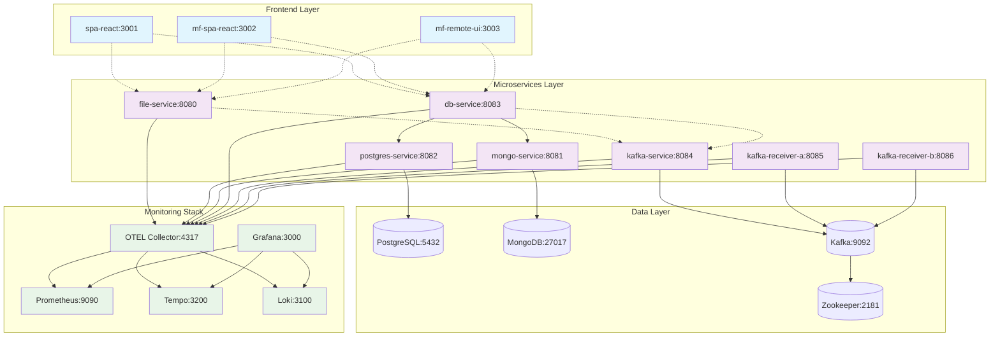

## 2. Flow Procesu Monitorowania

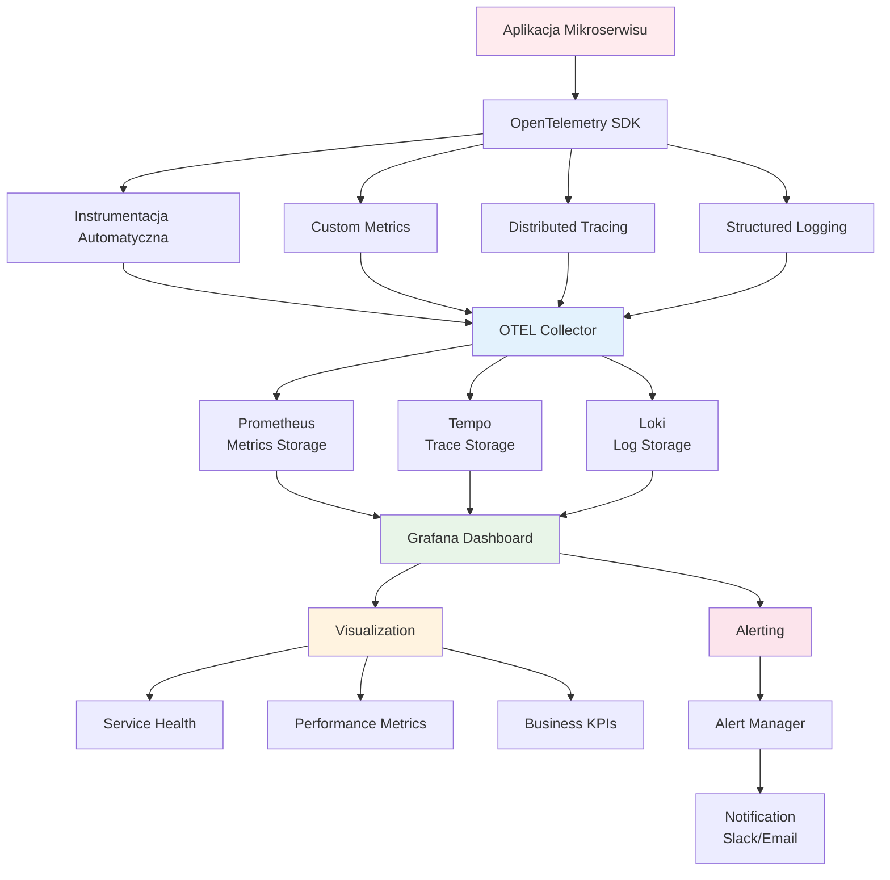

## 3. Proces Zbierania Metryk

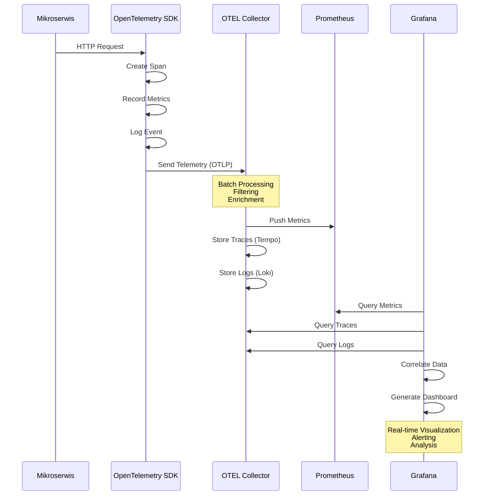

## 4. Model Procesowy Monitorowania

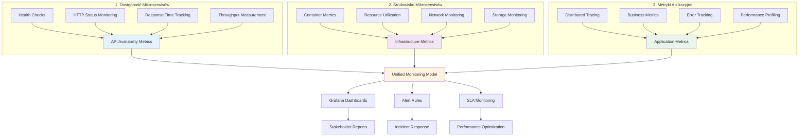

## 5. Architektura Telemetrii

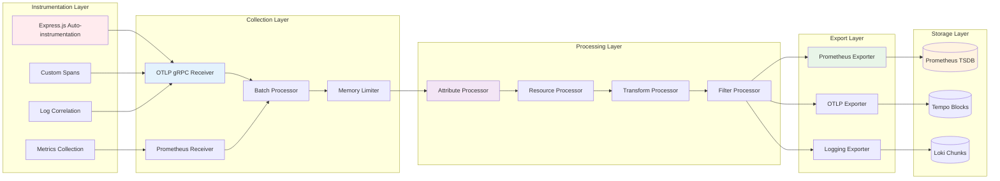

## 6. Service Dependency Map

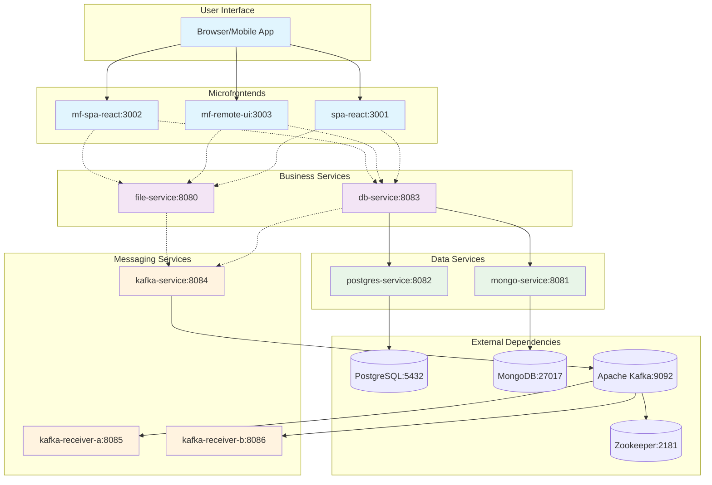

## 7. Monitoring Data Flow

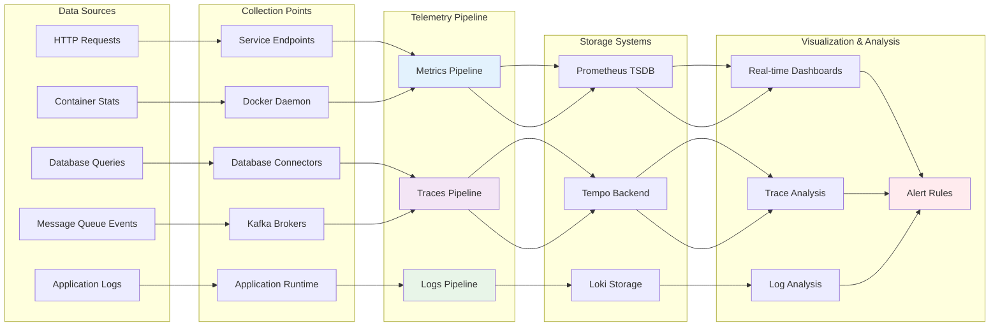

## 8. Alert Management Flow

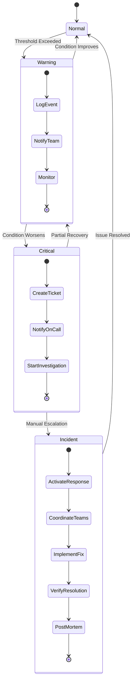

## 9. Performance Metrics Hierarchy

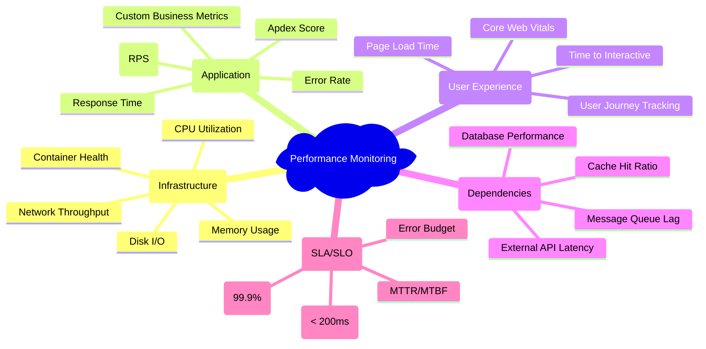

## 10. Single-SPA React - Service Dependencies

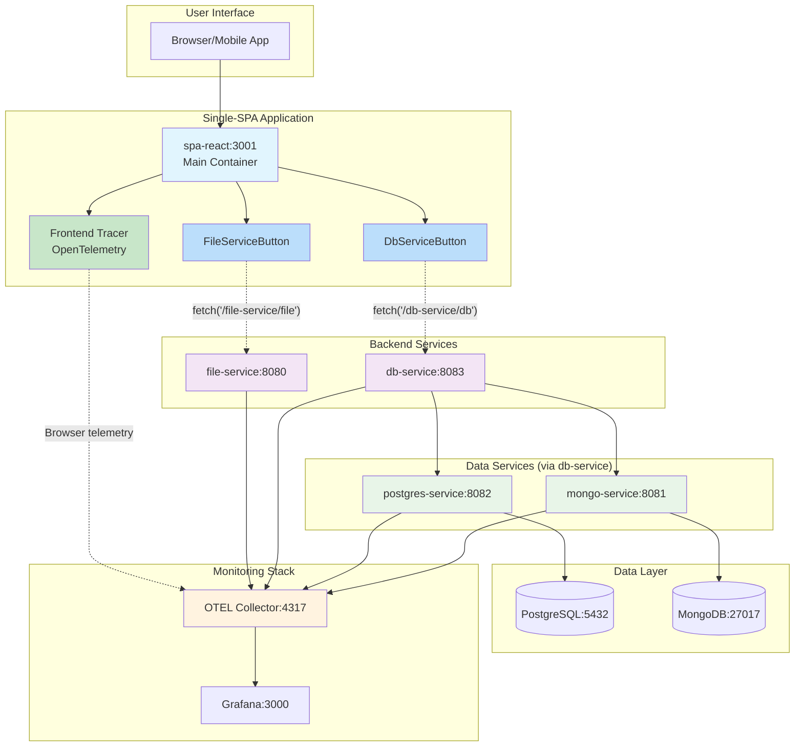

## 11. Mikrofrontendy - Module Federation Architecture

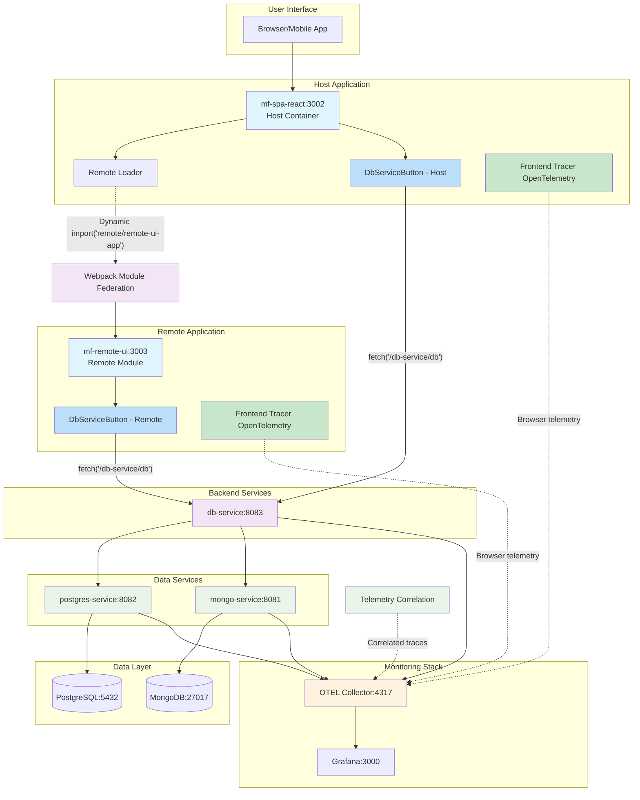
