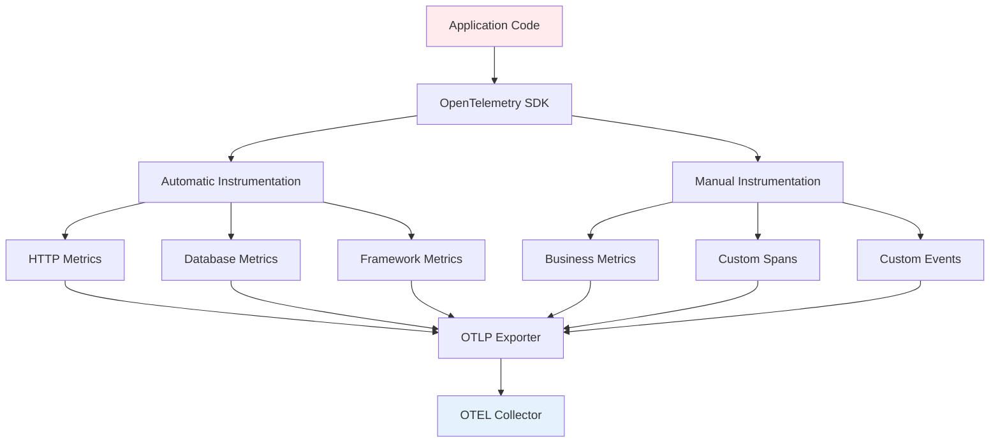
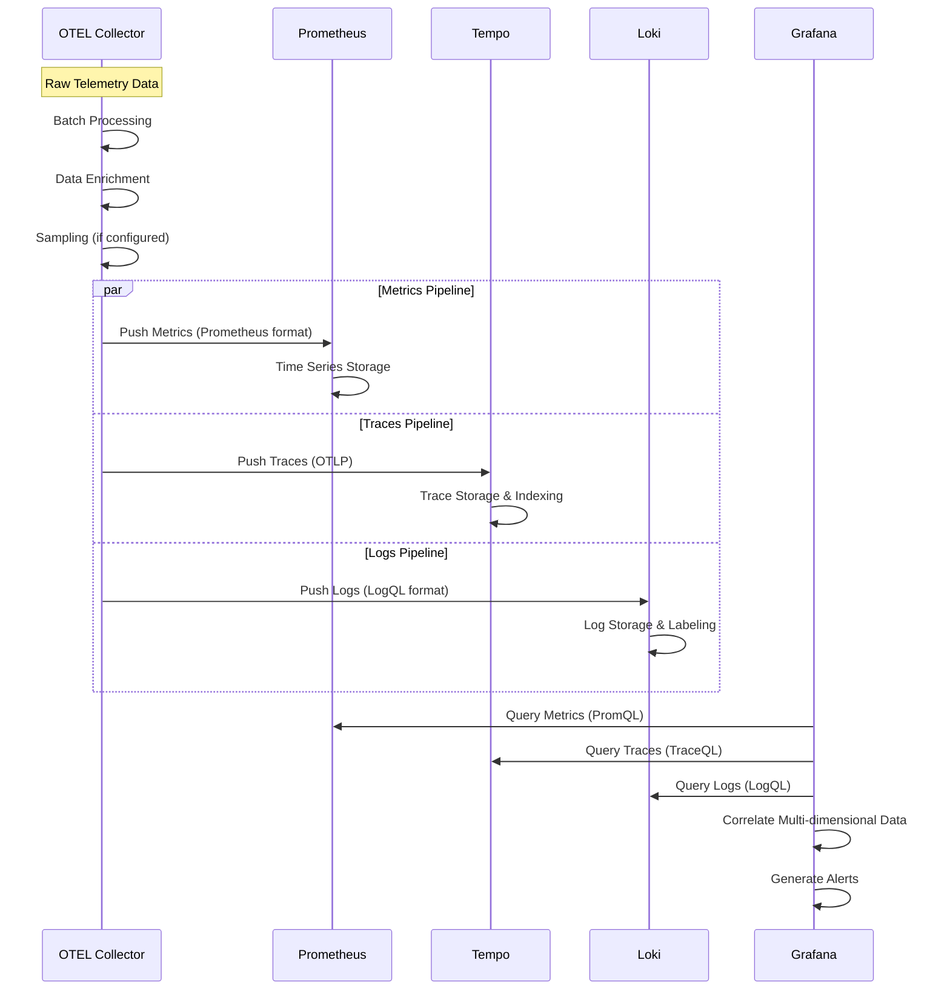

# Szczegółowa Analiza Metryk - Model Monitorowania Mikrofrontendów

## Analiza Ilościowa Metryk

### 1. Kategoryzacja Metryk według Warstw

#### Warstwa Mikrofrontendowa
| Metryka | Typ | Źródło | Częstotliwość | Próg Alertu |
|---------|-----|--------|---------------|-------------|
| Page Load Time | Timing | Browser Performance API | Real-time | > 3s |
| Time to Interactive (TTI) | Timing | Lighthouse/Core Web Vitals | Real-time | > 5s |
| Cumulative Layout Shift (CLS) | Score | Browser | Real-time | > 0.1 |
| First Contentful Paint (FCP) | Timing | Browser | Real-time | > 1.8s |
| JavaScript Bundle Size | Size | Build Process | Per deploy | > 1MB |
| API Call Success Rate | Percentage | Browser/XHR | Real-time | < 99% |

#### Warstwa Mikroserwisowa
| Metryka | Typ | Źródło | Częstotliwość | Próg Alertu |
|---------|-----|--------|---------------|-------------|
| HTTP Response Time | Duration | Express.js middleware | Per request | P95 > 200ms |
| Request Rate | Rate | Prometheus counter | 15s interval | > 1000 RPS |
| Error Rate | Percentage | HTTP status codes | Real-time | > 1% |
| Service Availability | Percentage | Health checks | 30s interval | < 99.9% |
| Database Query Time | Duration | ORM instrumentation | Per query | > 100ms |
| Memory Usage | Bytes | Node.js process | 15s interval | > 80% |
| CPU Utilization | Percentage | Container stats | 15s interval | > 80% |

#### Warstwa Infrastrukturalna
| Metryka | Typ | Źródło | Częstotliwość | Próg Alertu |
|---------|-----|--------|---------------|-------------|
| Container Memory | Bytes | cAdvisor | 15s | > 90% limit |
| Container CPU | Percentage | cAdvisor | 15s | > 85% |
| Disk I/O | IOPS | Node Exporter | 15s | > 1000 IOPS |
| Network Throughput | Bytes/s | Container stats | 15s | > 100MB/s |
| Docker Container Status | State | Docker API | 30s | != running |

### 2. Metryki Integracyjne (Cross-Layer)

#### Distributed Tracing Metrics
```
Trace Duration = sum(span_durations) gdzie spans ∈ request_trace
Error Propagation Rate = (failed_traces / total_traces) × 100%
Service Dependency Score = (successful_downstream_calls / total_downstream_calls)
```

#### Business Impact Metrics
```
User Journey Completion = (completed_transactions / started_transactions) × 100%
Revenue Impact = sum(failed_transactions × avg_transaction_value)
Customer Satisfaction Score = correlation(performance_metrics, user_feedback)
```

### 3. Formulas i Kalkulacje

#### SLA Calculations
```
Availability = (Total_Time - Downtime) / Total_Time × 100%
Error Budget = (100% - SLA_Target) × Total_Requests
MTTR = Total_Recovery_Time / Number_of_Incidents
MTBF = Total_Operational_Time / Number_of_Failures
```

#### Performance Scoring
```
Apdex Score = (Satisfied_Count + Tolerating_Count/2) / Total_Samples
Performance Index = w1×Latency_Score + w2×Throughput_Score + w3×Error_Score
gdzie w1 + w2 + w3 = 1
```

---

## Proces Oceny Metryk - Detailed Flow

### Faza 1: Data Collection



### Faza 2: Data Processing



### Faza 3: Analysis & Alerting

#### Alert Rules Configuration

```yaml
# Przykładowe reguły alertów w Prometheus
groups:
  - name: microservice_alerts
    rules:
      - alert: HighErrorRate
        expr: rate(http_requests_total{status=~"5.."}[5m]) > 0.01
        for: 2m
        labels:
          severity: critical
        annotations:
          summary: "High error rate detected"
          description: "Error rate is {{ $value }} errors per second"

      - alert: HighLatency
        expr: histogram_quantile(0.95, rate(http_request_duration_seconds_bucket[5m])) > 0.2
        for: 5m
        labels:
          severity: warning
        annotations:
          summary: "High latency detected"
          description: "95th percentile latency is {{ $value }}s"

      - alert: ServiceDown
        expr: up == 0
        for: 1m
        labels:
          severity: critical
        annotations:
          summary: "Service is down"
          description: "{{ $labels.instance }} has been down for more than 1 minute"
```

---

## Implementacja Techniczna Metryk

### 1. Mikroserwisy - Node.js/Express Implementation

```typescript
// Enhanced metrics implementation
import { createPrometheusMetrics } from '@prometheus/client';
import { trace, metrics } from '@opentelemetry/api';

class MetricsCollector {
    private readonly httpRequestDuration: Histogram;
    private readonly httpRequestTotal: Counter;
    private readonly dbQueryDuration: Histogram;
    private readonly businessMetrics: Counter;

    constructor() {
        const meter = metrics.getMeter('microservice-metrics');
        
        this.httpRequestDuration = meter.createHistogram('http_request_duration_seconds', {
            description: 'Duration of HTTP requests in seconds',
            boundaries: [0.1, 0.3, 0.5, 0.7, 1, 3, 5, 7, 10]
        });

        this.httpRequestTotal = meter.createCounter('http_requests_total', {
            description: 'Total number of HTTP requests'
        });

        this.dbQueryDuration = meter.createHistogram('db_query_duration_seconds', {
            description: 'Duration of database queries in seconds'
        });

        this.businessMetrics = meter.createCounter('business_operations_total', {
            description: 'Total number of business operations'
        });
    }

    recordHttpRequest(duration: number, method: string, status: number, endpoint: string) {
        const labels = { method, status: status.toString(), endpoint };
        this.httpRequestDuration.record(duration, labels);
        this.httpRequestTotal.add(1, labels);
    }

    recordDbQuery(duration: number, operation: string, table: string) {
        this.dbQueryDuration.record(duration, { operation, table });
    }

    recordBusinessOperation(operation: string, success: boolean) {
        this.businessMetrics.add(1, { operation, success: success.toString() });
    }
}

// Middleware implementation
export const metricsMiddleware = (collector: MetricsCollector) => {
    return (req: Request, res: Response, next: NextFunction) => {
        const startTime = Date.now();
        
        res.on('finish', () => {
            const duration = (Date.now() - startTime) / 1000;
            collector.recordHttpRequest(
                duration,
                req.method,
                res.statusCode,
                req.route?.path || req.path
            );
        });
        
        next();
    };
};
```

### 2. Mikrofrontendy - Browser Performance Metrics

```typescript
// Browser performance monitoring
class FrontendMetrics {
    private readonly performanceObserver: PerformanceObserver;
    private readonly metricsEndpoint: string;

    constructor(metricsEndpoint: string) {
        this.metricsEndpoint = metricsEndpoint;
        this.initializePerformanceObserver();
        this.collectCoreWebVitals();
    }

    private initializePerformanceObserver() {
        this.performanceObserver = new PerformanceObserver((list) => {
            for (const entry of list.getEntries()) {
                this.sendMetric({
                    name: entry.name,
                    value: entry.duration || entry.value,
                    type: entry.entryType,
                    timestamp: Date.now()
                });
            }
        });

        this.performanceObserver.observe({ 
            entryTypes: ['navigation', 'resource', 'measure', 'mark'] 
        });
    }

    private collectCoreWebVitals() {
        // Largest Contentful Paint
        new PerformanceObserver((list) => {
            const entries = list.getEntries();
            const lastEntry = entries[entries.length - 1];
            this.sendMetric({
                name: 'largest_contentful_paint',
                value: lastEntry.startTime,
                type: 'core_web_vital',
                timestamp: Date.now()
            });
        }).observe({ entryTypes: ['largest-contentful-paint'] });

        // First Input Delay
        new PerformanceObserver((list) => {
            for (const entry of list.getEntries()) {
                this.sendMetric({
                    name: 'first_input_delay',
                    value: entry.processingStart - entry.startTime,
                    type: 'core_web_vital',
                    timestamp: Date.now()
                });
            }
        }).observe({ entryTypes: ['first-input'] });

        // Cumulative Layout Shift
        let clsValue = 0;
        new PerformanceObserver((list) => {
            for (const entry of list.getEntries()) {
                if (!entry.hadRecentInput) {
                    clsValue += entry.value;
                }
            }
            this.sendMetric({
                name: 'cumulative_layout_shift',
                value: clsValue,
                type: 'core_web_vital',
                timestamp: Date.now()
            });
        }).observe({ entryTypes: ['layout-shift'] });
    }

    recordUserInteraction(action: string, component: string, duration?: number) {
        this.sendMetric({
            name: 'user_interaction',
            value: duration || 1,
            type: 'user_event',
            labels: { action, component },
            timestamp: Date.now()
        });
    }

    recordAPICall(endpoint: string, method: string, status: number, duration: number) {
        this.sendMetric({
            name: 'api_call_duration',
            value: duration,
            type: 'api_performance',
            labels: { endpoint, method, status: status.toString() },
            timestamp: Date.now()
        });
    }

    private async sendMetric(metric: any) {
        try {
            await fetch(this.metricsEndpoint, {
                method: 'POST',
                headers: { 'Content-Type': 'application/json' },
                body: JSON.stringify(metric)
            });
        } catch (error) {
            console.warn('Failed to send metric:', error);
        }
    }
}
```

---

## Analiza ROI i Skuteczności

### Metryki Biznesowe

#### Impact Measurement
```
Performance_Impact_Score = Σ(weight_i × normalized_metric_i)
gdzie:
- weight_i = Business importance factor [0-1]
- normalized_metric_i = (actual_value - baseline) / baseline

Business_Value = (Performance_Improvement × Revenue_Per_Transaction × Transaction_Volume)
Cost_of_Downtime = (Minutes_Down × Revenue_Per_Minute × Customer_Impact_Factor)
```

#### ROI Calculation
```
Monitoring_ROI = (Benefits - Costs) / Costs × 100%

Benefits:
- Reduced MTTR costs
- Prevented downtime losses  
- Improved customer satisfaction
- Developer productivity gains

Costs:
- Infrastructure costs (Grafana, Prometheus, etc.)
- Implementation time
- Maintenance overhead
- Training costs
```

## Rekomendacje Implementacyjne

### Fazy Wdrożenia

#### Faza 1: Foundation (Week 1-2)
1. **Podstawowa instrumentacja**
   - HTTP request/response metrics
   - Basic health checks
   - Container resource monitoring

2. **Minimalna infrastruktura**
   - Prometheus setup
   - Basic Grafana dashboards
   - Simple alerting rules

#### Faza 2: Enhancement (Week 3-4)
1. **Distributed tracing**
   - OpenTelemetry implementation
   - Cross-service correlation
   - Performance bottleneck identification

2. **Advanced metrics**
   - Business KPIs
   - User experience metrics
   - Custom application metrics

#### Faza 3: Optimization (Week 5-6)
1. **Advanced analytics**
   - Predictive alerting
   - Anomaly detection
   - Capacity planning

2. **Integration & automation**
   - CI/CD pipeline integration
   - Automated remediation
   - SLA/SLO monitoring

### Best Practices

#### Metric Design Principles
1. **HIGH**: High cardinality metrics (user_id, session_id)
2. **MEDIUM**: Medium cardinality (service, endpoint)  
3. **LOW**: Low cardinality (environment, region)

#### Alert Fatigue Prevention
```yaml
# Example: Smart alerting configuration
alert_rules:
  error_rate:
    threshold: 1%
    duration: 2m
    escalation:
      - level: warning (1%)
      - level: critical (5%)
      - level: emergency (10%)
  
  latency:
    percentile: 95th
    threshold: 200ms
    consecutive_breaches: 3
    cooldown: 10m
```

#### Performance Optimization
- **Sampling**: 1% for traces, 100% for critical paths
- **Retention**: 15d for metrics, 7d for traces, 30d for logs
- **Compression**: Enable for all storage backends
- **Sharding**: Implement for high-volume environments
